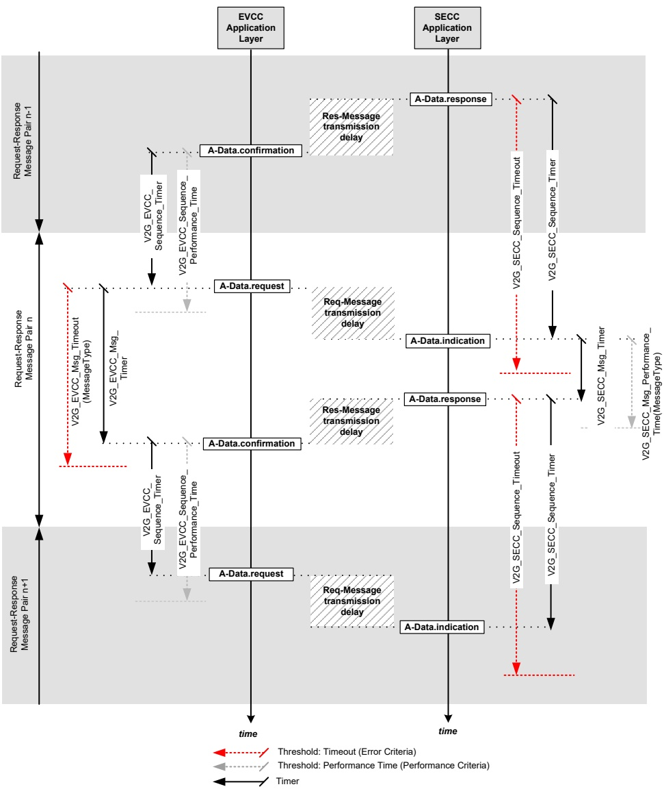

Figure 212 — Message sequence and session timing

###### 8.5.4.1.1 EVCC timing for request-response message pairs

[V2G20-436]

The EVCC shall set the timeout V2G_EVCC_Msg_Timeout depending on the value MessageType as defined in Table 215, reset the V2G_EVCC_Msg_Timer and start monitoring the V2G_EVCC_Msg_Timer when it sends a request message.

NOTE 1 In this document sending a request message is described by A-Data.request.