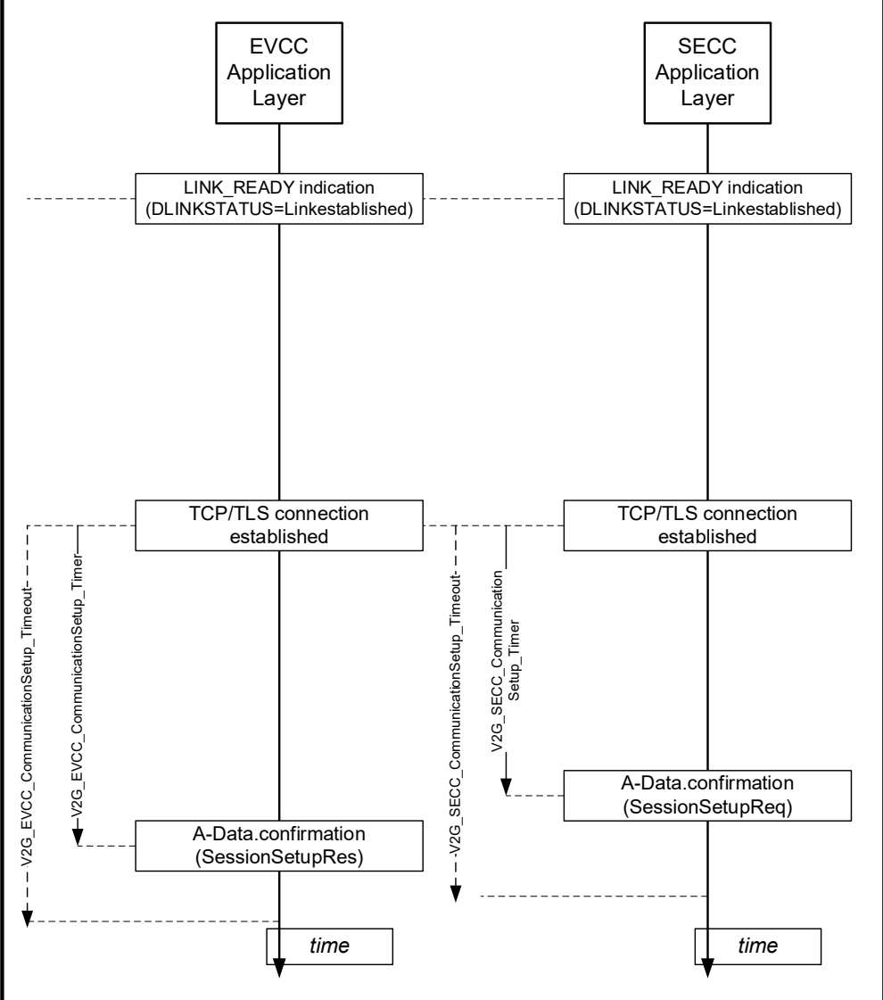

Figure 213 — CommunicationSetup timing

###### 8.5.5.1.1 EVCC Timing for communication session setup

[V2G20-2295] If the EVCC receives an SDP response message with parameter DiagStatus equal to "Ongoing" for the first time it shall start the timer V2G_EVCC_Ongoing_Timer and wait