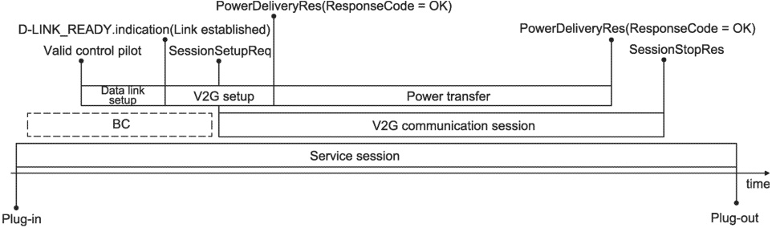

[V2G20-1400] The EVCC shall wait for the pre charging to finish, indicated by the EV determining that the EVSE output voltage, as measured inside the EV, has sufficiently been adjusted to the EV RESS voltage.

[V2G20-706] The EVCC shall stop waiting for the pre charging to finish and stop monitoring the V2G_EVCC_DC_PreCharge_Timer when V2G_EVCC_DC_PreCharge_Timer is equal or larger than V2G_EVCC_DC_PreCharge_Timeout. It shall then apply the error handling as defined in 8.6.

[V2G20-1401] The EVCC shall stop monitoring the V2G_EVCC_DC_PreCharge_Timer when V2G_EVCC_DC_PreCharge_Timer is smaller than V2G_EVCC_DC_PreCharge_Timeout and pre charging has finished, indicated by the EV determining that the EVSE output voltage, as measured inside the EV, has sufficiently been adjusted to the EV RESS voltage. It shall then process the response message as defined in 8.6.

##### 8.5.5.3 WPT specific timings

Operational timing requirements are given in IEC 61980-2.

#### 8.5.6 V2G message synchronization for AC and DC with IEC 61851-1 signalling

##### 8.5.6.1 Overview

ISO 15118 based energy transfer control extends PWM signal over a control pilot wire according to IEC 61851-1:2017, Annex A. For this, the messaging on application layer is synchronized with the CP states defined in IEC 61851-1:2017, Annex A.

ISO 15118 based messaging is able to manage the AC and DC charging process for a complete charging session from the beginning to the end in 5 % or 100 % duty cycle case.

In this subclauses, terms and definitions in requirements are applied as defined in ISO 15118-3 and IEC 61851-1:2017, Annex A.

Figure 214 shows an example for AC energy transfer with BC and HLC-C in relation to service session and phases of data link setup, V2G setup and V2G power transfer loop during a V2G communication session.

Figure 214 — AC example for BC and HLC-C energy transfer in relation to service session

The V2G power transfer loop is defined as V2G messaging phase for controlling the energy transfer process by the ISO 15118 series in normal operation. The power transfer phase under control of the ISO 15118 series is defined as high level communication charging (HLC-C).

The entry and exit conditions for the V2G power transfer loop are as follows: