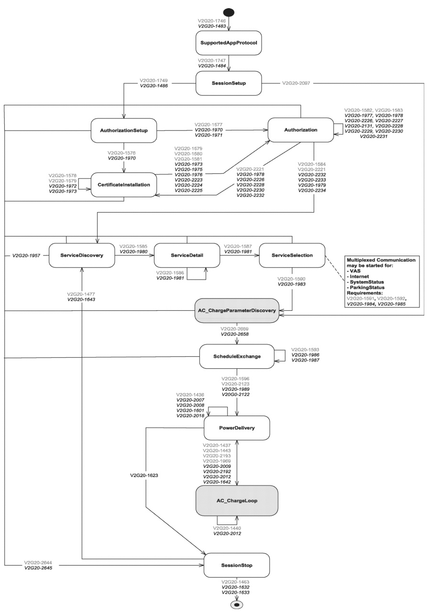

key

Text EVCC

Text SECC

Figure 215 — AC message sequence diagram

438

Copied with the permission of ANSI on behalf of ISO in connection with USDOT National Electric Vehicle Infrastructure (NEVI) Formula Program. Copying not permitted. ©ISO. All rights reserved.