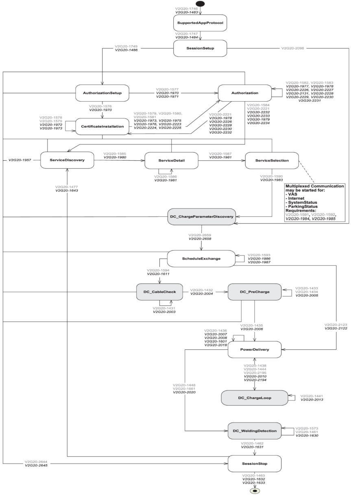

Figure 216 shows the DC message sequence diagram.

Key

Text EVCC

Text SECC

Figure 216 — DC message sequence diagram

Copied with the permission of ANSI on behalf of ISO in connection with USDOT National Electric Vehicle Infrastructure (NEVI) Formula Program. Copying not permitted. ©ISO. All rights reserved.