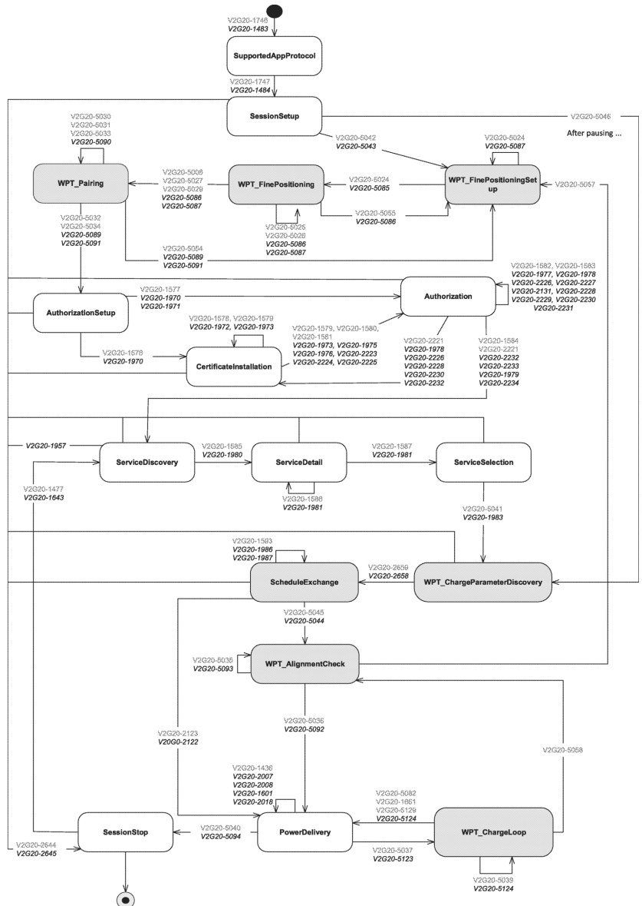

Figure 217 shows the WPT message sequence diagram.

Key

Text EVCC

Text SECC

Figure 217 — WPT message sequence diagram

Figure 218 shows the ACDP message sequence diagram.

## 440 

Copied with the permission of ANSI on behalf of ISO in connection with USDOT National Electric Vehicle Infrastructure (NEVI) Formula Program. Copying not permitted. ©ISO. All rights reserved.