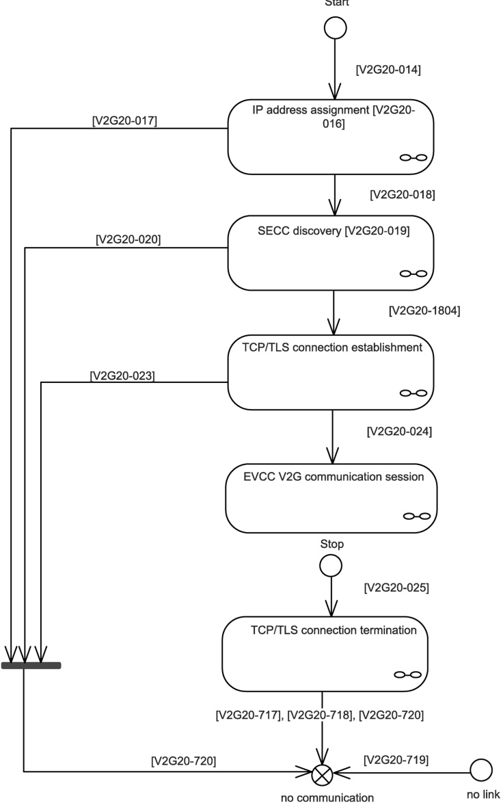

If the EVCC identifies any error it shall indicate a Data-Link error (D-LINK_ERROR.request()) and continue with [V2G20-014].

Figure 8 — Overview V2G communication states EVCC

Figure 9 depicts the general communication states of the V2G communication from an SECC perspective. The following applies for the SECC: