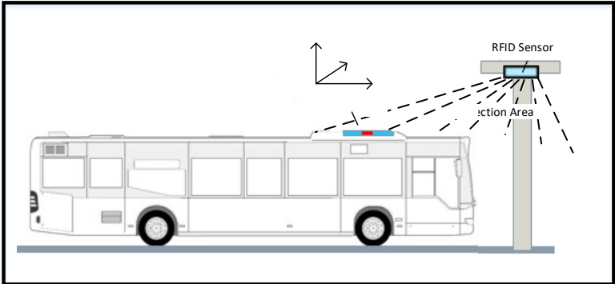

Figure E.1 — RFID configuration for ACDP association

##### E.2.1.1 Electrical and physical standards

The RFID tag(s) conform to the "EPCglobal UHF Gen 2 V1" standard, also known as "EPC Gen2". The EPC Gen2 uses conformity and interoperability tests to ensure that the Gen2 RFID products interact "cleanly". EPC Gen2 has been defined in ISO/IEC 18000-6.

In particular with these characteristics:

- frequency range: 902 MHz to 928 MHz;

– passive tags (no power supply required).

One to four tags are mounted for the ACDP counterpart specified in EN 50696:2021, Annex 2.1.

The RFID reader is not defined except that it should provide sufficient positional accuracy for pairing and for partitioning when reading the tags on the vehicle.

##### E.2.1.2 Tag data format

The tag data is distributed over two regions of the tag, the EPC-ID (Table E.1) and the user memory (Table E.2).

Table E.1 — EPC-ID

<table border=1 style='margin: auto; word-wrap: break-word;'><tr><td style='text-align: center; word-wrap: break-word;'>Description</td><td style='text-align: center; word-wrap: break-word;'>Length (Byte)</td><td style='text-align: center; word-wrap: break-word;'>Example</td></tr><tr><td style='text-align: center; word-wrap: break-word;'>Header (fix 0x51)</td><td style='text-align: center; word-wrap: break-word;'>1</td><td style='text-align: center; word-wrap: break-word;'>51</td></tr><tr><td style='text-align: center; word-wrap: break-word;'>Number of tags</td><td style='text-align: center; word-wrap: break-word;'>1</td><td style='text-align: center; word-wrap: break-word;'>04</td></tr><tr><td style='text-align: center; word-wrap: break-word;'>Tag position on bus roof</td><td style='text-align: center; word-wrap: break-word;'>1</td><td style='text-align: center; word-wrap: break-word;'>03 (for the third tag)</td></tr></table>