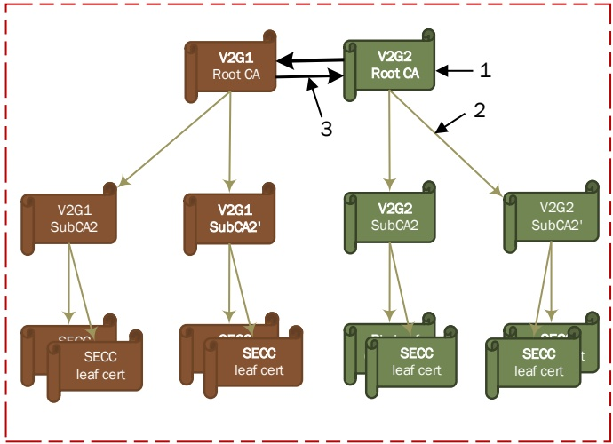
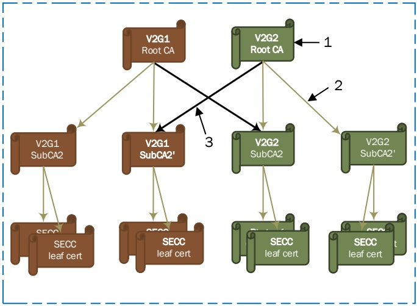

Key

y

1 certificate

2 direct certification

3 cross certification

Figure H.1 — Example of mutual cross certification at root level

Key

1 certificate

2 direct certification

3 cross certification

Figure H.2 — Example of mutual cross certification at sub CA level

Copied with the permission of ANSI on behalf of ISO in connection with USDOT National Electric Vehicle Infrastructure (NEVI) Formula Program. Copying not permitted. ©ISO. All rights reserved.