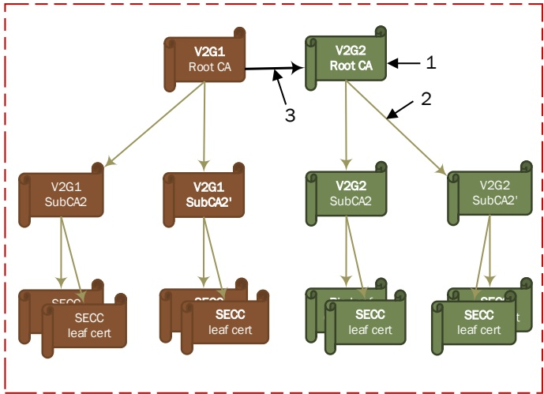

Figure H.2 provides an example of how to simply cross certify a few of the sub-CAs. This can allow those who want the benefit of cross-certification to take advantage of cross-certification while allowing those who do not wish to take on the additional risks associated with the cross-certification to continue without those risks.

##### H.1.5.2 Unilateral cross certification

The same example and argument provided at the beginning of H.1.5 can be flipped and applied to SECC as well. For a V2G session to be established, the SECC should be able to validate the EV's vehicle certificate, which is issued under a particular OEM root CA. If the SECC does not hold the corresponding OEM root CA certificate, a secure channel cannot be established between the SECC and the EVCC. However, the SECC manufacturer/operator cannot anticipate all the EVs that might visit the EVSE, and even so, an SECC may not be able to store all the necessary OEM root CA certificates. In this context, the cross certification of OEM root CA by the V2G root CA can ease the management of trust anchor. For example, if an OEM root CA is cross signed by the German V2G root CA, an SECC that does not have the OEM root CA certificate but does have German V2G root CA certificate, can validate the EV's vehicle certificate chain issued under the OEM root CA and charge the EV.

In this example, although German V2G root CA cross-certifies the OEM root CA, the OEM root CA does not cross-certify the German V2G root CA. Since the trust relationship is only extended in one direction, this is an example of unilateral cross-certification.

Examples of unilateral cross certification can be seen in Figure H.3 and Figure H.4.

3 cross certification

Figure H.3 — Example of unilateral cross certification at root CA level

