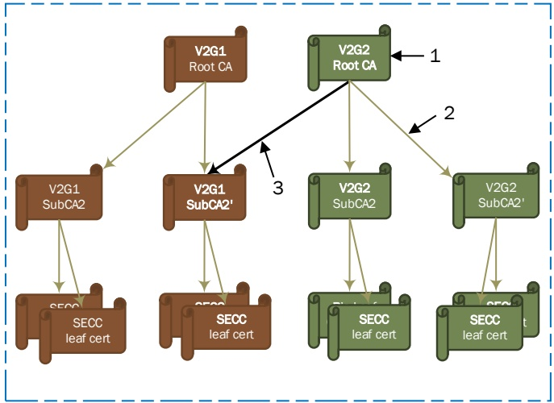

Figure H.4 — Example of unilateral cross certification at sub CA level

##### H.1.5.3 Advantages of cross certification

The advantage of cross-certification is that it allows reduction of trust anchors needed in the entities that need to validate the certificate chains of other entities. For example:

– an EV holding only one V2G root CA certificate could essentially charge at any EVSE regardless of the V2G root CA used for the generation of SECC's leaf if the V2G root CA (or any SubCA) of the SECC certificate is cross-signed by the V2G root CA certificate held by the EVCC;

– an EVSE holding only V2G root CA certificates could accept any EVs regardless of the OEM root CA certificates used for the generation of the EV's vehicle certificate if the EV's vehicle certificate is cross-signed by a V2G root CA whose V2G root CA certificate is held by the SECC.

##### H.1.5.4 Disadvantages of cross certification

While cross certification helps for flexible management of trust relationships, organizations need to be aware of the following issues regarding cross certificates.

If organization A cross certifies organization B's certificate(s), the security level of B's PKI will be affected by A as PKI-B should fulfill the required security levels of PKI-A because the validator that trusts A will go through the certificates of PKI-B having an illusion that these certificates are issued by PKI-A. If the certificate chain of PKI-B is compromised, and hence should not be trusted, the validator (e.g. EV) that trusts PKI-A can falsely trust the chain because the chain is apparently signed by the PKI-A. Therefore, before cross-certification, A makes sure B's PKI policy is compatible with A's PKI. This requirement may complicate the policy management of the PKIs involving cross-certification.