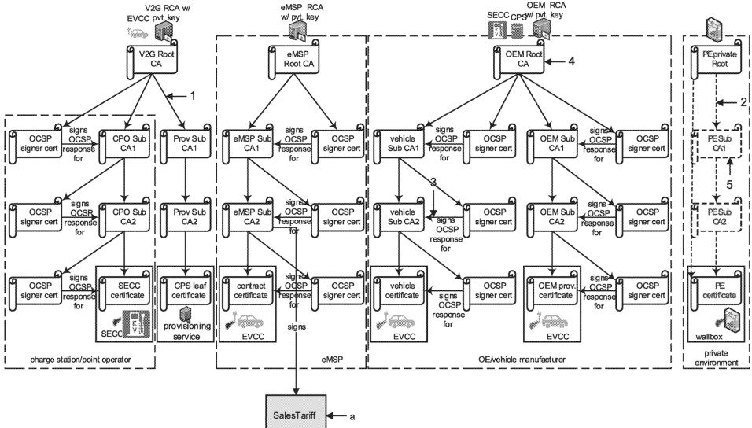

The certificate chain of an SECC is transmitted to the EVCC and the certificate chain of the EVCC is transmitted to the SECC to enable an authenticity check of the SECC and EVCC before a TLS connection is established (see above: in order to avoid man-in-the-middle attacks).

The certificate chain of a contract certificate is transmitted into the EVCC without a root CA certificate. This limits the transmission to 3 certificates (4 if a cross-certificate is included), but this also means, that the EV cannot verify its own contract certificate.

It should be noted that these examples show certificates not servers. It is possible to run multiple CAs on the same server. It is left to the implementers and the PKI governing policies to decide how best to implement the CAs.

Example 1 as shown in Figure H.5 shows an example certificate structure. In this example, the SECC certificate originates from the V2G root CA certificate chain. All other main actors like the eMSP and the OEM utilize their own root certificates for the leaf certificates like the contract certificate, vehicle certificate, etc. In this example, none of the certificates are cross signed. This means that the SECC needs the OEM root CA certificate to validate the vehicle certificate during TLS session setup.

## key

1 direct certification

2 optional direct certification

3 OCSP response

4 certificate

5 optional certificate

The SalesTariff is not a certificate. The black arrow does not depict a certificate signing or certificate derivation/origination. SalesTariff is data that is signed by the eMSP using the private key of the eMSP sub-CA2. This is unusual. Mostly data is signed using keys from a leaf certificate, not a CA certificate. To reduce the need for another leaf certificate in the vehicle, SalesTariff is signed by the eMSP using the private key of the eMSP sub-CA2 certificate. Since, in a PnC use case, the EVCC always contains the eMSP sub-CA2 as part of its contract certificate chain, the EVCC always has the associated public key for eMSP sub-CA2 that it can use to verify the signatures on salestariff that were applied by the said eMSP. The SalesTariff is not signed in EIM.

