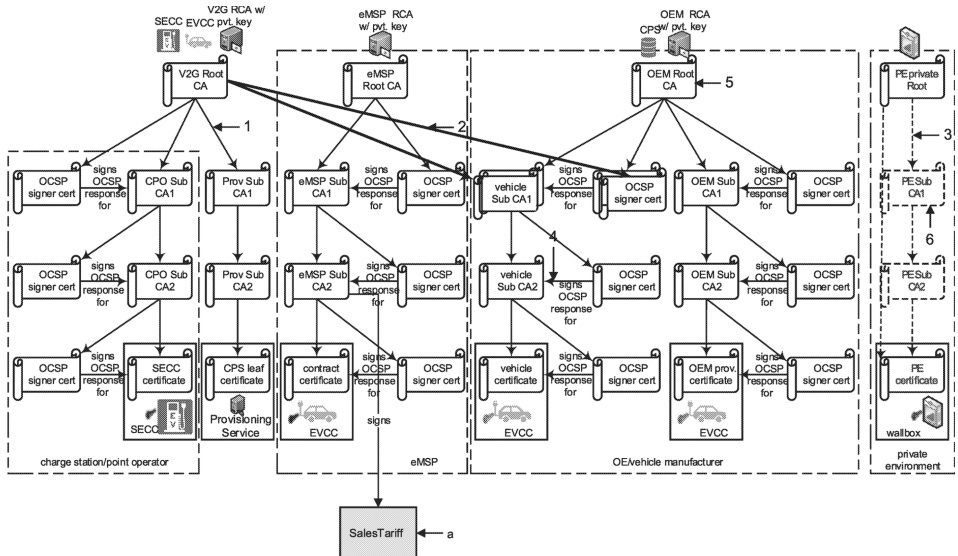

### Figure H.5 — Example 1 of the certificate structure (no cross signing)

Example 2 as shown in Figure H.6 shows example 1 of the certificate structure but with the vehicle certificate chain cross signed by the V2G root CA certificate. This allows the SECC to validate the vehicle certificate using the V2G root CA certificate during TLS session setup. The SECC does not need OEM root CA certificate to validate the vehicle certificate.

In this example of cross signing (example 2 as shown in Figure H.6, there are 2 separate vehicle sub-CA1 certificates:

— one that is signed by the OEM root CA certificate;

- another that is signed by the V2G root CA certificate.

Both of the vehicle sub-CA1 certificates have the same exact public/private key pair.

When an SECC requests the EVCC to send its vehicle certificate for TLS session setup, the SECC provides the list of root CA certificates that it supports. The EVCC provides the appropriate vehicle certificate chain that the SECC can validate using the root CA certificates available to it.

In some cases that would mean EVCC providing the vehicle sub-CA1 certificate signed by OEM root CA certificate while in others it would provide the vehicle sub-CA1 certificate signed by V2G root CA certificate.

Similarly, each of those vehicle sub-CA1 certificates may refer to the same exact OCSP server though the OCSP server certificate used in each case will be signed by the appropriate root CA certificate.

It should be noted that there are other examples and methodologies for cross signing. Refer to H.1.5 and its subclauses for further details and examples of cross signing.

## Key

1 direct certification

2 cross certification

3 optional direct certification

## 522 

Copied with the permission of ANSI on behalf of ISO in connection with USDOT National Electric Vehicle Infrastructure (NEVI) Formula Program. Copying not permitted. ©ISO. All rights reserved.