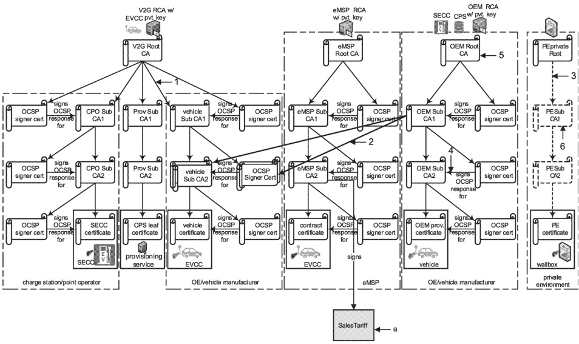

## key

SalesTariff is not a certificate. The black arrow does not depict a certificate signing or certificate derivation/origination. SalesTariff is data that is signed by the eMSP using the private key of the eMSP sub-CA2. This is unusual. Mostly data is signed using keys from a leaf certificate, not a CA certificate. To reduced the need for another leaf certificate in the vehicle, SalesTariff is signed by the eMSP using the private key of the eMSP sub-CA2 certificate. Since, in a PnC use case, the EVCC always contains the eMSP sub-CA2 as part of its contract certificate chain, the EVCC always has the associated public key for eMSP sub-CA2 that it can use to verify the signatures on SalesTariff that were applied by the said eMSP. SalesTariff is not signed in EIM.

### Figure H.7 — Example 3 of a certificate structure (no cross signing)

Example 4 as shown in Figure H.8 shows Example 3 certificate structure but with the vehicle certificate chain cross signed by the OEM root CA certificate chain. This allows the SECC to validate the vehicle certificate using the OEM root CA certificate during TLS session setup. The SECC does not need V2G root CA certificate to validate the vehicle certificate.

In this example of cross signing (example 4 as shown in Figure H.8), there are 2 separate vehicle sub-CA2 certificates:

- one that is signed by the OEM root CA certificate chain;

- another that is signed by the V2G root CA certificate chain.

Both of the vehicle sub-CA2 certificates have the same exact public/private key pair.

When an SECC requests the EVCC to send its vehicle certificate for TLS session setup, the SECC provides the list of root CA certificates that it supports. The EVCC provides the appropriate vehicle certificate chain that the SECC can validate using the root CA certificates available to it.