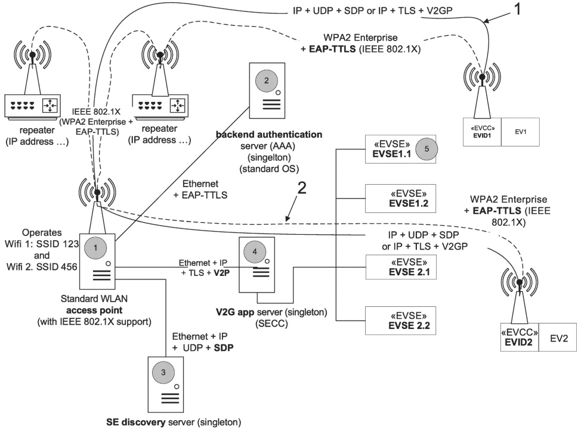

If it is desired to use remote authentication dial-in user service (RADIUS) as the authentication, authorization, and accounting (AAA or Triple A) management solution, RFCs mentioned in this subclause shall be followed.

## [V2G20-2245]

Remote authentication dial in user service (RADIUS) as defined in IETF RFC 2865 shall be implemented.

NOTE 5 IETF RFC 2865 has been updated by IETF RFC 2868, IETF RFC 3575, IETF RFC 5080, IETF RFC 6929 and IETF RFC 8044. IETF RFC 2868 has been updated by IETF RFC 3575. IETF RFC 3575 has been updated by IETF RFC 6929. All these updates are considered to be included in this document.

[V2G20-2246] RADIUS accounting requirements specified in IETF RFC 2866 shall be implemented.

NOTE 6 IETF RFC 2866 has been updated by IETF RFC 2867, IETF RFC 5080 and IETF RFC 5997. All these updates are considered to be included in this document.

There are multiple other IETF RFCs that are necessary to implement RADIUS. This document does not list all of them. RFCs related to RADIUS and dated before the publication of this document should be considered for RADIUS implementation.

##### 7.5.1.2 Example of secure WLAN connection setup

This subclause uses RADIUS as a synonym for this type of security architecture.

Figure 10 shows an example of the steps (circled numbers) involved in establishing a connection for wireless power transfer (WPT) using RADIUS.

© ISO 2022 – All rights reserved

Copied with the permission of ANSI on behalf of ISO in connection with USDOT National Electric Vehicle Infrastructure (NEVI) Formula Program. Copying not permitted. ©ISO. All rights reserved.

