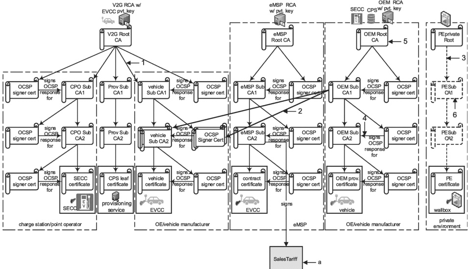

In some cases that would mean EVCC providing the vehicle sub-CA2 certificate signed by OEM root CA certificate chain while in others it would provide the vehicle sub-CA2 certificate signed by V2G root CA certificate chain.

Similarly, each of those vehicle sub-CA2 certificate may refer to the same exact OCSP server though the OCSP server certificate used in each case will be signed by the appropriate root CA certificate.

It should be noted that there are other examples and methodologies for cross signing. Refer to H.1.5 and its subclauses for further details and examples of cross signing.

SalesTariff is not a certificate. The black arrow does not depict a certificate signing or certificate derivation/origination. SalesTariff is data that is signed by the eMSP using the private key of the eMSP sub-CA2. This is unusual. Mostly data is signed using keys from a leaf certificate, not a CA certificate. To reduced the need for another leaf certificate in the vehicle, SalesTariff is signed by the eMSP using the private key of the eMSP sub-CA2 certificate. Since, in a PnC use case, the EVCC always contains the eMSP sub-CA2 as part of its contract certificate chain, the EVCC always has the associated public key for eMSP sub-CA2 that it can use to verify the signatures on SalesTariff that were applied by the said eMSP. SalesTariff is not signed in EIM.

Figure H.8 — Example 4 of a certificate structure with cross signing

Example 4 in Figure H.8 shows two separate vehicle sub-CA2 certificates; one is signed by the OEM root CA certificate chain while the other is signed by the V2G root CA certificate chain. Both of them have the same exact public/private key pair.