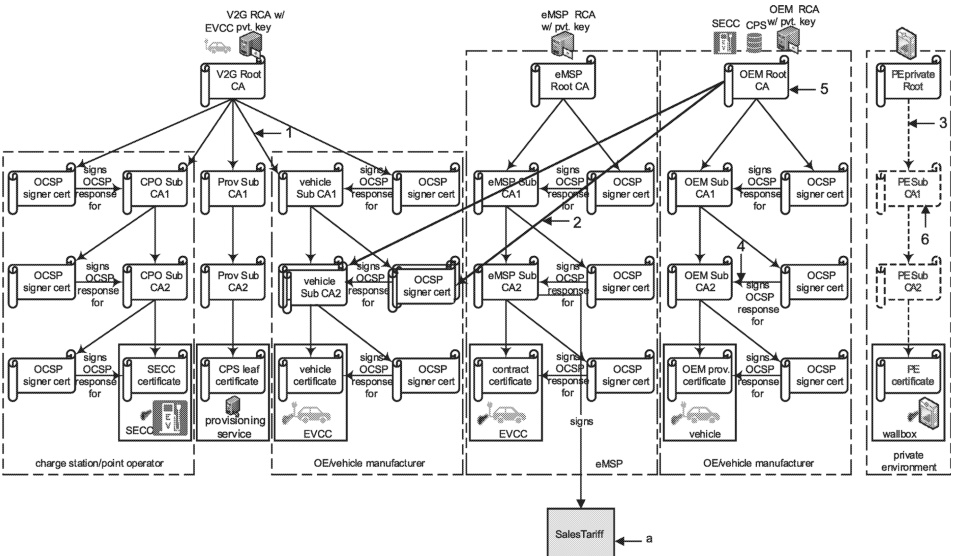

## Key

1 direct certification

2 cross certification

3 optional direct certification

4 OCSP response

5 certificate

6 optional certificate

SalesTariff is not a certificate. The black arrow does not depict a certificate signing or certificate derivation/origination. SalesTariff is data that is signed by the eMSP using the private key of the eMSP sub-CA2. This is unusual. Mostly data is signed using keys from a leaf certificate, not a CA certificate. To reduced the need for another leaf certificate in the vehicle, SalesTariff is signed by the eMSP using the private key of the eMSP sub-CA2 certificate. Since, in a PnC use case, the EVCC always contains the eMSP sub-CA2 as part of its contract certificate chain, the EVCC always has the associated public key for eMSP sub-CA2 that it can use to verify the signatures on SalesTariff that were applied by the said eMSP. SalesTariff is not signed in EIM.

### Figure H.9 — Example 5 of a certificate structure with cross signing

Example 5 in Figure H.9 shows two separate vehicle sub-CA2 certificates; one is signed by the OEM root CA certificate while the other is signed by the V2G root CA certificate chain. Both of them have the same exact public/private key pair.

When a SECC requests the EVCC to send its vehicle certificate for TLS session setup, the SECC provides the lists of root CA certificate that it supports. The EVCC provides the appropriate vehicle certificate chain that the SECC can validate using the root CA certificates available to it.

In some cases that would mean EVCC providing the vehicle sub-CA2 certificate signed by OEM root CA certificate while in others it would provide the vehicle sub-CA2 certificate signed by V2G root CA certificate.

Any sub-CA used to derive/generate vehicle certificate should be signed/cross-signed by a V2G root CA certificate. This ensures that the SECC will be able to verify the vehicle certificate even if it does not have the OEM root CA certificate.