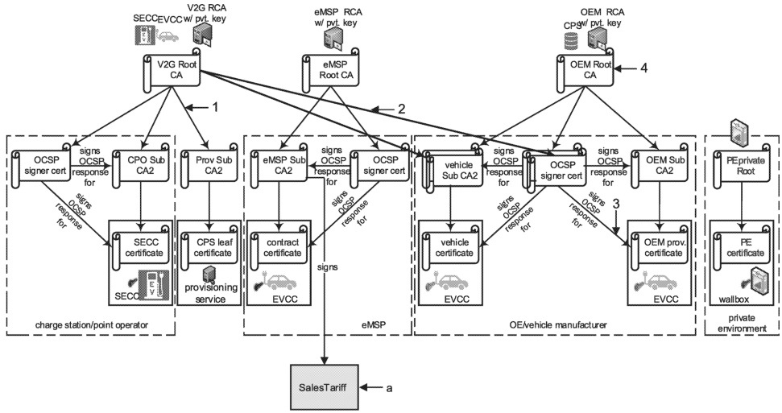

The vehicle certificate as shown above in Figure H.5, Figure H.6, Figure H.7, Figure H.8 and Figure H.9, could be derived or generated from the same sub-CAs used to derive or generate OEM provisioning certificate. It is left up to the discretion of the OEM (EV manufacturer) whether to use separate sub-CAs for vehicle certificate and OEM provisioning certificate or not.

All OCSP signer certificates can be directly signed by the root certificate. This means that a single OCSP certificate signed by the V2G root CA certificate can be used to sign OCSP responses for CSO sub-CA1 certificate, CSO sub-CA2 certificate and SECC certificate. This also means that, regardless of the Figure H.5 depicting the need for separate OCSP certificates and servers, a single OCSP server can provide OCSP responses for CSO sub-CA1 certificate, CSO sub-CA2 certificate and SECC certificate.

The same methodology also applies to the certificates maintained by the OEM (EV manufacturer). A single OCSP certificate signed by the OEM root CA certificate (and cross-signed by the V2G root CA certificate) can be used to sign OCSP responses for OEM sub-CA1 certificate, vehicle sub-CA1 certificate, OEM sub-CA2 certificate, vehicle sub-CA2 certificate, OEM provisioning certificate and vehicle certificate. This also means that, regardless of the Figure H.5 depicting the need for separate OCSP certificates and servers, a single OCSP server can provide OCSP responses for OEM sub-CA1 certificate, vehicle sub-CA1 certificate, OEM sub-CA2 certificate, vehicle sub-CA2 certificate, OEM provisioning certificate and vehicle certificate.

Additionally sub-CA1 for all certificate chains could be bypassed. Similarly, sub-CA2 for private environments is optional.

Figure H.10 below depicts an alternative (simplified) certificate structure resulting from the comments above.

