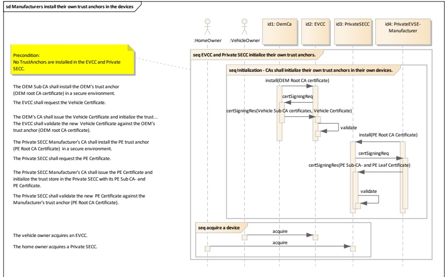

For challenge 2, PE EVSE manufacturers and OEMs do not install the trust anchors for the leaf certificates that their devices/EVs are allowed to work with. The user performs some explicit actions on both the PE EVSE and the vehicle to install the necessary trust anchors. This will be a one-time action if the same PE EVSE and the same vehicle are used. It may be performed again if the EV visits different PE EVSEs (see Figure H.11 for details of this process).

Figure H.11 — Installation of PE certificate chain for challenge 1 and 2

##### H.2.2.2 Installation of a PE certificate into an EVSE

Typically some certificate for the private SECC is included on delivery and gets preinstalled by the manufacturer for convenience reasons.

For security reasons the certificates in private SECC should be upgradeable and replaceable by the CSO.

The manufacturers of EVSEs which are targeted at the use in private environments should provide the CSO with documentation and the necessary tools to enable the replacement of outdated or potentially compromised certificates.

Certificate installation could be done by using any secure communication channel offered for this purpose. This may include a local network interface, an USB interface or similar technologies. It is highly recommended that for security reasons an activation of this upgrade mode or a confirmation of this step is physically performed on the PE EVSE (e.g. by entering a PIN, etc.). This ensures that only authorized personnel are allowed to modify the core security configurations of the private SECC.

##### H.2.2.3 Installation of root CA certificates in the private SECC/EVCC

For challenge 2, after the manufacturer has installed their root CA certificate chain in the device/EV, the root CA certificates of other manufacturers to enable mutual authentication are still missing.

The user may need to put both the private SECC and the EVCC in a certificate provisioning mode for private environment (CPM4PE) to install the trust anchors necessary to establish TLS session for V2G communications.