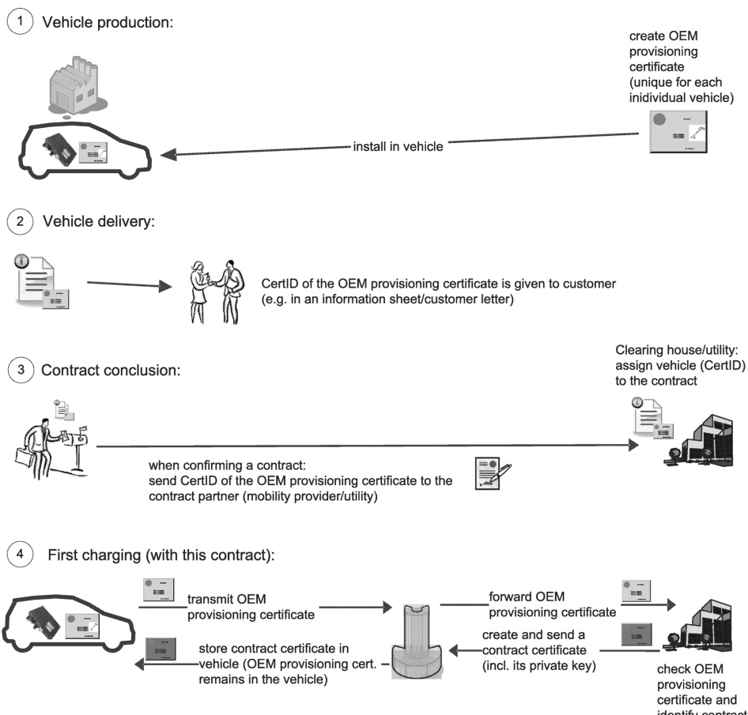

Figure H.13 — Activities required for OEM certificate provisioning

#### H.5.1 Processes

##### H.5.1.1 Vehicle production

At EV production time, unique OEM provisioning certificates and the corresponding private keys are installed in each EV (refer to Figure H.13 – Step 1). Each OEM provisioning certificate contains a unique ID (for short: PCID) and is derived from the OEM provisioning root certificate of the issuing OEM.

##### H.5.1.2 Vehicle hand-over

At or before EV hand-over, the customer is informed about his/her PCID (refer to Figure H.13, step 2), e.g. by distributing information sheets, integrating the PCID in the EV documentation, offering online access to the PCID, etc.

##### H.5.1.3 Contract conclusion