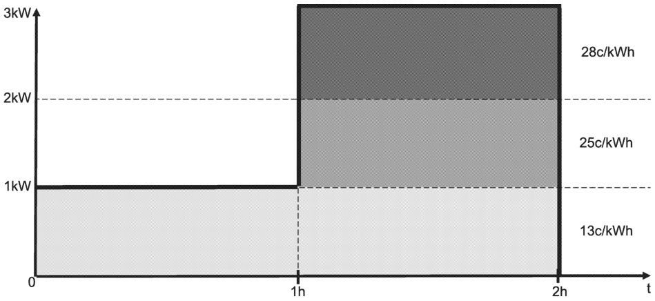

<v2gci_ct:Value>4</v2gci_ct:Value>
</ParkingFee>
<PowerRangeStart>
    <v2gci_ct:Exponent>0</v2gci_ct:Exponent>
    <v2gci_ct:Value>0</v2gci_ct:Value>
</PowerRangeStart>
</PriceRule>
</PriceRuleStack>
</PriceRuleStacks>

<OverstayRules>
<OverstayRuleDescription>overstay</OverstayRuleDescription>
<OverstayRule>
<StartTime>3600</StartTime>
<OverstayFee>
<v2gci_ct:Exponent>0</v2gci_ct:Exponent>
<v2gci_ct:Value>4</v2gci_ct:Value>
</OverstayFee>
<OverstayFeePeriod>3600</OverstayFeePeriod>
</OverstayRule>
<OverstayRule>
<StartTime>7200</StartTime>
<OverstayFee>
<v2gci_ct:Exponent>0</v2gci_ct:Exponent>
<v2gci_ct:Value>8</v2gci_ct:Value>
</OverstayFee>
<OverstayFeePeriod>3600</OverstayFeePeriod>
</OverstayRule>
<OverstayRule>
<StartTime>10800</StartTime>
<OverstayFee>
<v2gci_ct:Exponent>0</v2gci_ct:Exponent>
<v2gci_ct:Value>16</v2gci_ct:Value>
</OverstayFee>
<OverstayFeePeriod>3600</OverstayFeePeriod>
</OverstayRule>
</OverstayRules>
</AbsolutePriceSchedule>

#### J.3.5 Stacked prices

If Stacked Prices are used, this impacts how the total price is calculated. Considering Figure J.1, different prices may be assigned to different power levels during different points in time.

Figure J.1 — Example of Stacked Prices usage

<?xml version="1.0" encoding="UTF-8"?>

Copied with the permission of ANSI on behalf of ISO in connection with USDOT National Electric Vehicle Infrastructure (NEVI) Formula Program. Copying not permitted. ©ISO. All rights reserved.