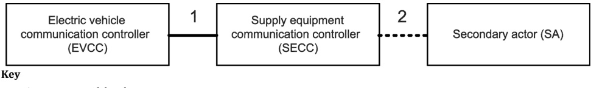

# Road vehicles — Vehicle to grid communication interface — Part 20: Network and application protocol requirements

## 1 Scope

This document specifies the communication between the electric vehicle (EV), including battery electric vehicle (BEV) and plug-in hybrid electric vehicle (PHEV), and the electric vehicle supply equipment (EVSE). The application layer messages defined in this document are designed to support the electricity power transfer between an EV and an EVSE.

This document defines the communication messages and sequence requirements for bidirectional power transfer.

This document furthermore defines requirements of wireless communication for both conductive charging and wireless charging as well as communication requirements for automatic connection device and information services about charging and control status.

The purpose of this document is to detail the communication between an electric vehicle communication controller (EVCC) and a supply equipment communication controller (SECC). Aspects are specified to detect a vehicle in a communication network and enable an Internet Protocol (IP) based communication between the EVCC and the SECC (see Figure 1).

2 message definition considers use cases defined for communication between SECC to SA

Figure 1 — Communication relationship among the EVCC, SECC and SA

This document defines messages, data model, XML/EXI-based data representation format, usage of V2GTP, TLS, TCP and IPv6. These requirements belong to the 3 $ ^{rd} $ until the 7 $ ^{th} $ OSI layer model. In addition, the document describes main service sequences of conductive charging, wireless power transfer and bidirectional power transfer, and how data link layer services can be accessed from an OSI layer 3 perspective.

## 2 Normative references

The following documents are referred to in the text in such a way that some or all of their content constitutes requirements of this document. For dated references, only the edition cited applies. For undated references, the latest edition of the referenced document (including any amendments) applies.

ISO 3780, Road vehicles – World Manufacturer Identifier (WMI) code

ISO 4217, Codes for the representation of currencies