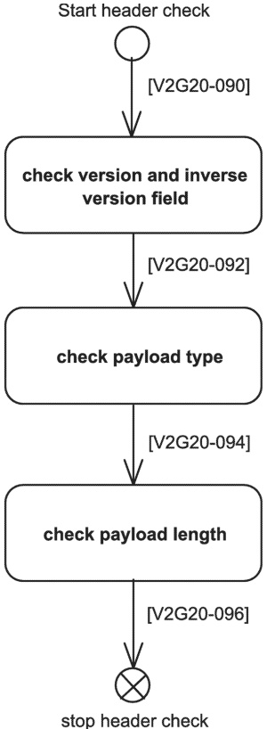

If the V2GTP header contains wrong data (e.g. not supported payload type, wrong payload length, or not supported V2GTP version) the V2GTP entity shall ignore this message.

Figure 11 — V2GTP generic header handler

### 7.9 Presentation layer

#### 7.9.1 XML and efficient XML interchange (EXI)

##### 7.9.1.1 Overview

For the purpose of describing the V2G message set the presentation layer uses the widely adopted XML data representation. The document defines messages (i.e. data structures and data types) based on XML schema which allows the type aware use of XML and enables simplified validity evaluation of exchanged messages.

## [V2G20-097]

When transmitting V2G messages defined in this document by using XML all V2G entities shall use encoding format according to definitions of W3C EXI 1.0.

##### 7.9.1.2 Efficient XML interchange