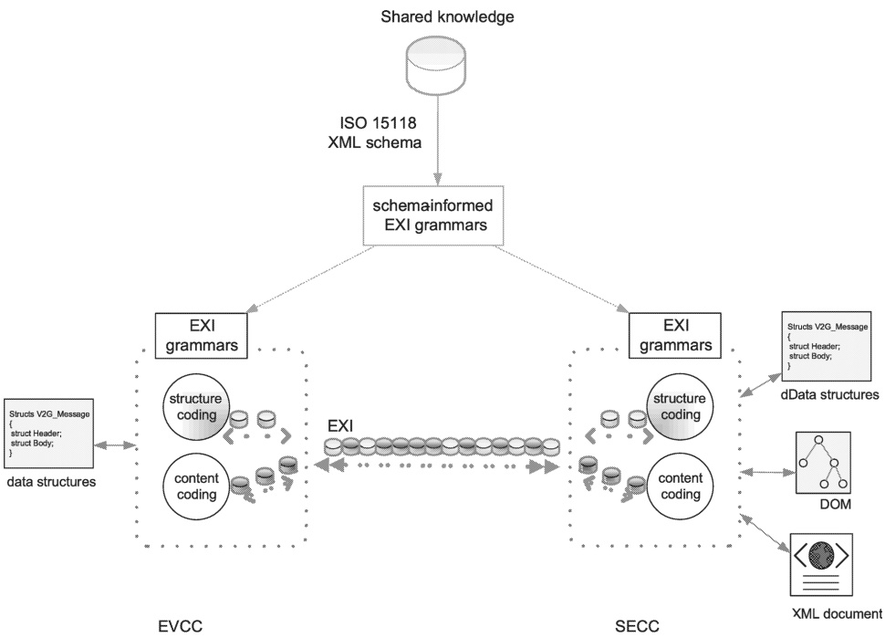

Figure 12 — Basic concept of EXI applied to V2G communication

##### 7.9.1.3 EXI settings for application layer messages

The following EXI settings are used for the EXI-based V2G communication.

[V2G20-1020] The XML schema with the namespace "urn:iso:std:iso:15118:-20:CommonMessages" shall be used for encoding and decoding EXI streams sent or received with Part20MainstreamPayloadID and defined in 8.3.4.1. For the definition of the XML Schema, refer to Annex A.

[V2G20-2308] The XML schema with the namespace "urn:iso:std:iso:15118:-20:AC" shall be used for encoding and decoding EXI streams sent or received with Part20ACMainstreamPayloadID and defined in 8.3.4.4.

[V2G20-2309] The XML schema with the namespace "urn:iso:std:iso:15118:-20:DC" shall be used for encoding and decoding EXI streams sent or received with Part20DCMainstreamPayloadID and defined in 8.3.4.5.

[V2G20-4106] The XML schema with the namespace "urn:iso:std:iso:15118:-20:ACDP" shall be used for encoding and decoding EXI streams sent or received with Part20ACDPMainstreamPayloadID and defined in 8.3.4.7.

[V2G20-5125] The XML schema with the namespace "urn:iso:std:iso:15118:-20:WPT" shall be used for encoding and decoding EXI streams sent or received with Part20WPTMainstreamPayloadID and defined in 8.3.4.6.