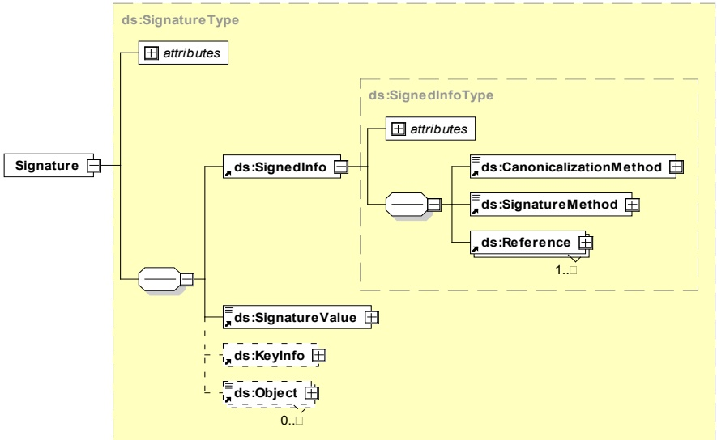
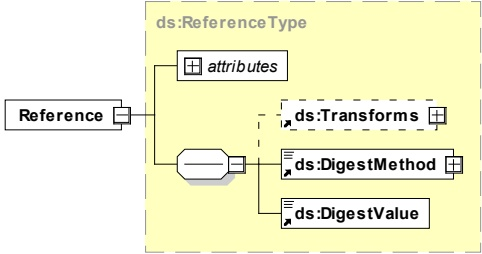

Figure 13 — Schema diagram - XML signature

Figure 14 shows the schema diagram of the element Reference included in the element SignedInfo which is part of the XML Signature depicted in Figure 13.

Figure 14 — Schema diagram - element Reference included in element SignedInfo

[V2G20-117] Each V2G entity shall support detached XML signatures.

[V2G20-119] For XML signature operations, the data which gets signed, shall be the EXI representation of this data.

[V2G20-764] As canonicalization method EXI with schema-informed fragment grammar shall be used.

[V2G20-765] Each message that needs the XML signature framework shall use the value "http://www.w3.org/TR/canonical-exi/" as algorithm attribute within the canonicalization method element.